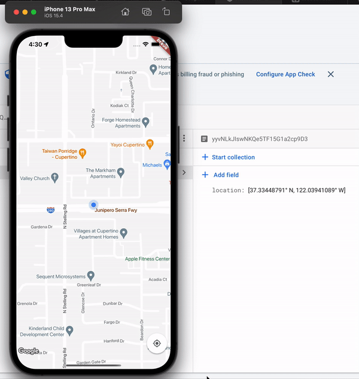

# Map App

In Town test location app.

## Getting Started

- [You can find the documentation to the project here.](https://intown-test.web.app)

- Here's a video recording of the app in action but modified to update location every 2 seconds (for testing)

## Things i would improve if given enough time

- I would check if location actually changed by some significant margin from the last location (of course to still fulfill the requirements), this way we can drastically reduce the number of writes to the firestore database.
- I would also organize my code cleaner and write more abstractions.
